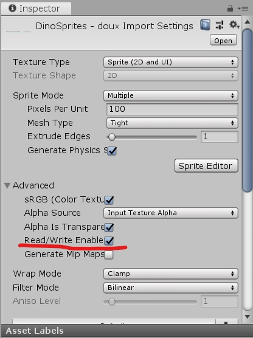
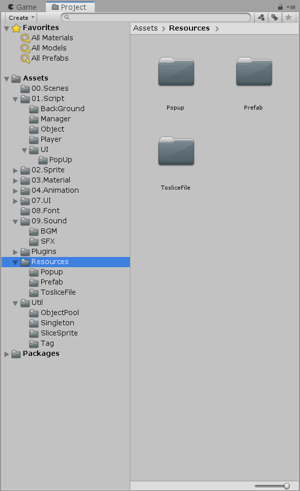
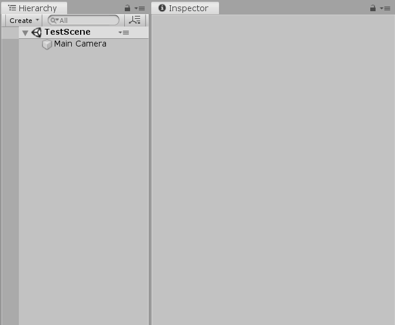
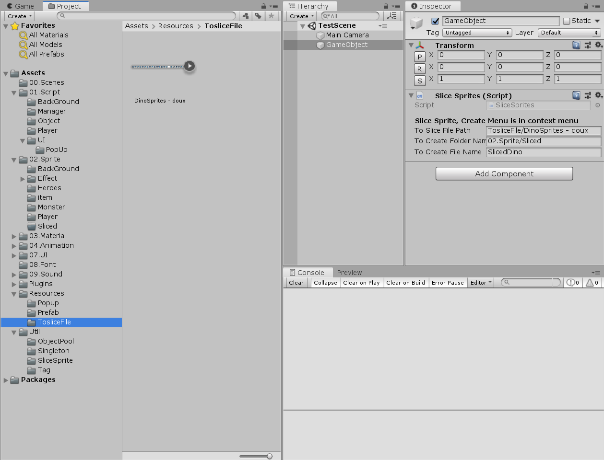
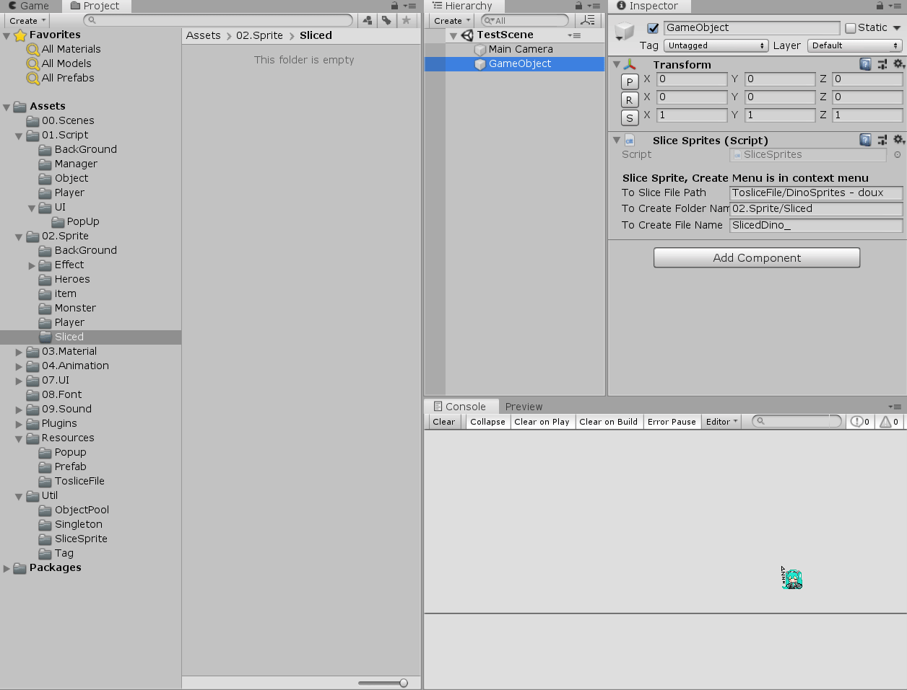

# Slice-AtlasSprites-as-png
아틀라스로된 이미지파일을 잘라줍니다..

##How 2 Use it

> A. 아틀라스 스프라이트가 Multiple이 아니라면 바꿔주세요 
> B. 아틀라스 스프라이트 옵션에 (Advanced) Read/Write Enable옵션을 켜주세요 
 
> C. 잘려질 아틀라스의 위치가 Resources폴더에 없다면 옮겨주세요 
 
> D. 빈 게임오브젝트를 생성하고 SliceSprite.cs 컴포넌트를 할당해주세요

> E. 이제 SliceSprite컴포넌트에 값들을 하나씩 할당해주세요

>> 1. To Slice File Path는 Resources에서 동적할당할 파일의 경로입니다. 
>> 2. To Create Folder Name은 잘려진 이미지파일들이 생성될 폴더 위치입니다 Assets폴더를 부모로 생성됩니다. 
>> 3. To Create File Name은 생성될 이미지파일들의 이름입니다. Index로 구분됩니다. 
(A와 B의 폴더는 이미 생성되이었는 폴더여야합니다!) 
 

>F. 경로설정이 끝나면 톱니바퀴모양에서 CreateFile을 눌러주세요
 